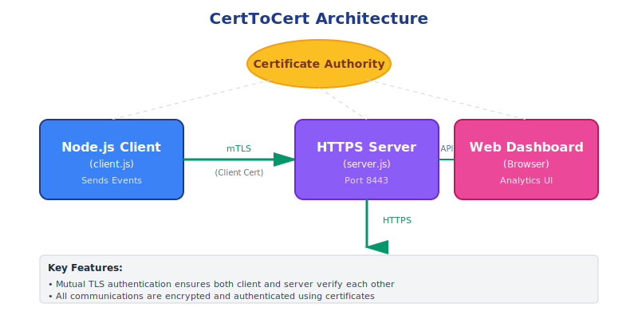
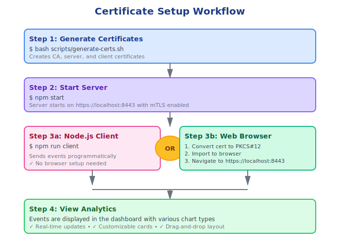

# CertToCert User Guide

## Table of Contents
1. [Introduction](#introduction)
2. [Architecture Overview](#architecture-overview)
3. [Prerequisites](#prerequisites)
4. [Installation](#installation)
5. [Setting Up Certificates](#setting-up-certificates)
6. [Starting the Server](#starting-the-server)
7. [Using the Node.js Client](#using-the-nodejs-client)
8. [Accessing the Web Dashboard](#accessing-the-web-dashboard)
9. [Dashboard Features](#dashboard-features)
10. [API Reference](#api-reference)
11. [Troubleshooting](#troubleshooting)

---

## Introduction

CertToCert is an analytics dashboard system that uses **mutual TLS (mTLS) authentication** to secure communications between clients and the server. This ensures that both the client and server authenticate each other using certificates, providing a high level of security.

### Key Features
- ✅ Mutual TLS authentication for secure communications
- 📊 Interactive analytics dashboard with multiple chart types
- 🔄 Real-time event tracking
- 🎨 Customizable dashboard cards
- 🔐 Client certificate-based authentication
- 📈 Multiple visualization options (Bar, Line, Pie, Doughnut, Radar, Polar Area)

---

## Architecture Overview



The system consists of three main components that communicate using mutual TLS authentication:

### Components
1. **Certificate Authority (CA)**: Issues and validates certificates
2. **Server**: HTTPS server with mTLS requirement (port 8443)
3. **Client**: Node.js client for sending events
4. **Web Dashboard**: Browser-based analytics interface

---

## Prerequisites

Before you begin, ensure you have the following installed:
- **Node.js** (v14 or higher)
- **npm** (comes with Node.js)
- **OpenSSL** (for certificate generation)
- **Modern web browser** (Chrome, Firefox, Safari, or Edge)

Check your installations:
```bash
node --version
npm --version
openssl version
```

---

## Installation

### Step 1: Clone the Repository
```bash
git clone https://github.com/cdapayne/CertToCert.git
cd CertToCert
```

### Step 2: Install Dependencies
```bash
npm install
```

This will install:
- `express` - Web server framework
- `axios` - HTTP client

---

## Setting Up Certificates



CertToCert uses mutual TLS, which requires generating certificates for the CA, server, and client.

### Automatic Certificate Generation

Run the provided script to generate all required certificates:

```bash
bash scripts/generate-certs.sh
```

### What This Script Does

The script generates:

1. **CA Certificate** (`ca-cert.pem`) and **CA Key** (`ca-key.pem`)
   - Used to sign server and client certificates
   
2. **Server Certificate** (`server-cert.pem`) and **Server Key** (`server-key.pem`)
   - CN (Common Name): `localhost`
   - Used by the HTTPS server
   
3. **Client Certificate** (`client-cert.pem`) and **Client Key** (`client-key.pem`)
   - CN (Common Name): `client`
   - Used by Node.js clients to authenticate

### Certificate Files

After running the script, you'll find these files in the `certs/` directory:

```
certs/
├── ca-cert.pem       # CA Certificate (public)
├── ca-key.pem        # CA Private Key
├── server-cert.pem   # Server Certificate (public)
├── server-key.pem    # Server Private Key
├── client-cert.pem   # Client Certificate (public)
└── client-key.pem    # Client Private Key
```

⚠️ **Security Note**: The `*-key.pem` files are private keys and should be kept secure. Never commit them to version control or share them publicly.


---

## Starting the Server

Start the analytics server:

```bash
npm start
```

You should see:
```
Analytics server listening on https://localhost:8443
```

The server:
- Listens on port **8443** (HTTPS)
- Requires valid client certificates
- Serves the web dashboard on `/` (root)
- Provides API endpoints at `/api/events`

### Server Configuration

The server is configured for strict mutual TLS:
```javascript
{
  requestCert: true,        // Require client certificate
  rejectUnauthorized: true  // Reject invalid certificates
}
```


---

## Using the Node.js Client

The Node.js client (`client.js`) allows you to send events to the analytics server programmatically.

### Basic Usage

Run the example client:
```bash
npm run client
```

This sends a sample event: `{application: 'local-app', event: 'button_press'}`

### Programmatic Usage

You can import and use the client in your own Node.js applications:

```javascript
const { recordEvent } = require('./client.js');

// Send an event
recordEvent('my-application', 'user_login')
  .then(status => console.log('Event recorded, status:', status))
  .catch(err => console.error('Failed to record event:', err));
```

### Event Structure

Events must have two properties:
- `application` (string): The name of your application
- `event` (string): The event name/type

Examples:
```javascript
recordEvent('web-app', 'page_view');
recordEvent('mobile-app', 'button_click');
recordEvent('desktop-app', 'file_open');
```

### Sending Multiple Events

```javascript
const { recordEvent } = require('./client.js');

async function sendBulkEvents() {
  const events = [
    { app: 'web-app', event: 'page_view' },
    { app: 'mobile-app', event: 'app_start' },
    { app: 'desktop-app', event: 'file_save' }
  ];
  
  for (const e of events) {
    await recordEvent(e.app, e.event);
  }
}

sendBulkEvents();
```


---

## Accessing the Web Dashboard

The web dashboard provides a visual interface for analyzing events.

### Browser Setup for Mutual TLS

Since the server requires client certificates, you need to configure your browser:

#### Option 1: Import Client Certificate (Recommended)

1. **Convert PEM to PKCS#12 format** (required for most browsers):
   ```bash
   openssl pkcs12 -export -out certs/client.p12 \
     -inkey certs/client-key.pem \
     -in certs/client-cert.pem \
     -certfile certs/ca-cert.pem
   ```
   You'll be prompted to create a password - remember this!

2. **Import into your browser**:

   **Chrome/Edge:**
   - Settings → Privacy and security → Security → Manage certificates
   - Import → Select `certs/client.p12`
   - Enter the password you created

   **Firefox:**
   - Settings → Privacy & Security → Certificates → View Certificates
   - Your Certificates → Import → Select `certs/client.p12`
   - Enter the password

   **Safari (macOS):**
   - Double-click `certs/client.p12`
   - Keychain Access will open
   - Enter password and import

3. **Trust the CA Certificate**:
   - Import `certs/ca-cert.pem` as a trusted root certificate
   - This prevents SSL warnings

4. **Navigate to the dashboard**:
   ```
   https://localhost:8443
   ```

#### Option 2: Using curl with Certificates

For testing without browser setup:
```bash
curl --cert certs/client-cert.pem \
     --key certs/client-key.pem \
     --cacert certs/ca-cert.pem \
     https://localhost:8443/api/events
```


---

## Dashboard Features

### Main Dashboard (index.html)

The main dashboard displays your analytics cards in a customizable grid layout.

#### Features:
- 📊 **Multiple chart cards** displaying different metrics
- 🔄 **Drag and drop** to reorder cards
- ❌ **Remove cards** individually
- 📈 **Live data** from the events API
- 🎨 **Color-coded** visualizations


### Creating a New Report Card (reports.html)

Click **"Add Card"** from the main dashboard to create a new visualization.

#### Configuration Options:

1. **Title**: Name your report card
2. **Group By**: 
   - `application` - Group events by application name
   - `event` - Group events by event type
3. **Chart Type**:
   - Bar Chart
   - Line Chart
   - Pie Chart
   - Doughnut Chart
   - Radar Chart
   - Polar Area Chart

#### Live Preview
As you configure your card, a live preview updates to show how it will look.

#### Steps to Create a Card:
1. Navigate to **Add Card** page
2. Enter a descriptive **Title**
3. Select **Group By** option (application or event)
4. Choose a **Chart Type**
5. Preview updates automatically
6. Click **"Add to Dashboard"**
7. You're redirected to the main dashboard with your new card


### Sending Test Events (test-event.html)

For testing purposes, you can manually send events through the web interface.

#### Steps:
1. Navigate to **Send Event** page
2. Enter **Application** name
3. Enter **Event** name
4. Click **Send Event**
5. Status message confirms success or failure

This is useful for:
- Testing the system
- Demonstrating functionality
- Debugging issues


### Dashboard Interactions

#### Reordering Cards
- Click and drag any card to reorder
- Layout is automatically saved to browser localStorage
- Changes persist across sessions

#### Removing Cards
- Click the **×** button in the top-right corner of any card
- Card is immediately removed
- Dashboard updates automatically

#### Card Limit
- Maximum of **20 cards** per dashboard
- This prevents performance issues with large datasets


---

## API Reference

### Endpoints

#### POST `/api/events`

Send an event to the analytics server.

**Request:**
```json
{
  "application": "string",
  "event": "string"
}
```

**Response:**
- `204 No Content` - Success
- `400 Bad Request` - Missing application or event field

**Example:**
```bash
curl -X POST https://localhost:8443/api/events \
  --cert certs/client-cert.pem \
  --key certs/client-key.pem \
  --cacert certs/ca-cert.pem \
  -H "Content-Type: application/json" \
  -d '{"application": "test-app", "event": "test_event"}'
```

#### GET `/api/events`

Retrieve all recorded events.

**Response:**
```json
[
  {
    "application": "web-app",
    "event": "page_view",
    "timestamp": "2025-10-27T20:00:00.000Z"
  },
  {
    "application": "mobile-app",
    "event": "button_click",
    "timestamp": "2025-10-27T20:01:00.000Z"
  }
]
```

**Example:**
```bash
curl https://localhost:8443/api/events \
  --cert certs/client-cert.pem \
  --key certs/client-key.pem \
  --cacert certs/ca-cert.pem
```

---

## Troubleshooting

### Common Issues

#### 1. "Certificate Authority Invalid" Error

**Problem:** Browser doesn't trust the self-signed CA certificate.

**Solution:** 
- Import the `ca-cert.pem` as a trusted root certificate
- Or accept the certificate warning in development

#### 2. "Client Certificate Required" Error

**Problem:** Client certificate not provided or not imported.

**Solution:**
- Ensure you've imported `client.p12` into your browser
- Verify the certificate is valid and not expired
- Check that the browser selected the correct certificate

#### 3. Server Won't Start

**Problem:** Port 8443 already in use or certificates missing.

**Solution:**
```bash
# Check if port is in use
lsof -i :8443

# Regenerate certificates
bash scripts/generate-certs.sh

# Restart server
npm start
```

#### 4. Events Not Appearing in Dashboard

**Problem:** Dashboard shows empty or no data.

**Solution:**
- Ensure events are being sent successfully
- Check browser console for errors
- Verify the server is running
- Test the API directly:
  ```bash
  curl --cert certs/client-cert.pem \
       --key certs/client-key.pem \
       --cacert certs/ca-cert.pem \
       https://localhost:8443/api/events
  ```

#### 5. "ECONNREFUSED" Error from Client

**Problem:** Client can't connect to server.

**Solution:**
- Ensure server is running: `npm start`
- Check server is on correct port (8443)
- Verify certificates exist in `certs/` directory

#### 6. Certificate Permission Errors

**Problem:** OpenSSL can't read certificate files.

**Solution:**
```bash
# Check permissions
ls -la certs/

# Fix permissions if needed
chmod 600 certs/*-key.pem
chmod 644 certs/*-cert.pem
```

### Getting Help

If you encounter issues not covered here:
1. Check the server logs for error messages
2. Verify all certificates are properly generated
3. Test with the Node.js client before using the browser
4. Open an issue on GitHub with details

---

## Security Best Practices

1. **Never commit private keys** to version control
2. **Regenerate certificates** for production use
3. **Use strong passwords** when creating PKCS#12 files
4. **Rotate certificates regularly** in production
5. **Keep dependencies updated** (`npm audit` and `npm update`)
6. **Use environment variables** for sensitive configuration in production

---

## Advanced Usage

### Customizing the Server

Edit `server.js` to customize:
- Port number (default: 8443)
- Certificate locations
- Event storage (currently in-memory)
- Add authentication middleware
- Add event validation

### Integrating with Other Applications

The client can be integrated into any Node.js application:

```javascript
const { recordEvent } = require('./path/to/client.js');

// In your application code
app.post('/purchase', async (req, res) => {
  // Handle purchase...
  
  // Record analytics event
  await recordEvent('shop-app', 'purchase_completed');
  
  res.send('Purchase complete');
});
```

### Data Persistence

Current implementation stores events in memory. For production:

1. **Add database support** (MongoDB, PostgreSQL, etc.)
2. **Modify endpoints** to read/write from database
3. **Add event retention policies**
4. **Implement data aggregation**

---

## License

ISC License - See repository for details.

---

## Support

For questions, issues, or contributions:
- GitHub: https://github.com/cdapayne/CertToCert
- Issues: https://github.com/cdapayne/CertToCert/issues

---

**Thank you for using CertToCert!** 🎉
